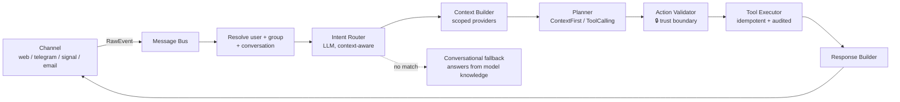

# 🏠 AgentPlatform

**A modular AI assistant platform where the AI is never the source of truth.**

AgentPlatform is a production-shaped framework for building **trustworthy, multi-channel AI assistants**.
It ships as a **household assistant** (payments, shopping, reminders, renewals…) and an extensible core
where every capability — domain logic, channels, web UIs, scheduled jobs, even public webhooks — is a
**drop-in plugin**. The language model *plans and converses*; **deterministic, idempotent tools** do the
acting and own the truth.

<p align="center">
  <a href="https://github.com/gr4b4z/Domsage/actions/workflows/docker.yml"></a>
  
  
  
  
</p>

---

## Why this exists

Most "AI agents" let the model decide *and* act *and* remember — so a hallucination becomes a wrong
payment, a leaked secret, or a runaway bill. AgentPlatform is built on the opposite premise:

| Principle | What it means in practice |
|---|---|
| 🧠 **AI is never the source of truth** | The LLM proposes a plan; state lives in Postgres and only changes through deterministic tools. Ask "what do I owe?" and the number comes from the database, not the model. |
| 🔒 **Structural context isolation** | Every household/workspace is isolated at the database level via PostgreSQL **Row-Level Security** — not by hoping the prompt behaves. |
| 👨‍👩‍👧 **Multi-user by design** | It's not a single-user chatbot. Every message is resolved to a specific **person within a group**, with roles, per-user preferences, shared-but-personal notifications, and natural references like "I'm going shopping with Agatha and Ola". |
| ✅ **Trust boundary on every action** | An `ActionValidator` checks the model's chosen tool, scope and role **before** anything runs. Side-effecting actions can require explicit confirmation. |
| ♻️ **Deterministic & idempotent tools** | Tools are plain C#. "Mark paid" twice = paid once (first-wins). Replays and retries are safe. |
| 💸 **Bounded spend** | A budget enforcer + circuit breaker cap LLM cost per request and per group. |
| 🧩 **Closed for modification, open for extension** | The core never changes to add a feature. You ship a plugin DLL — logic, DB schema, web UI, jobs and webhooks included. |

> The result: an assistant you can actually trust with your money, your data and your household —
> and a codebase an LLM can safely extend.

---

## What it feels like

```text
You      ›  przypomnij mi jutro o 14 odebrać córkę ze szkoły
Agent    ›  ⏰ Przypomnę Ci 29.06 14:00: odebrać córkę ze szkoły

You      ›  czy lisy lubią szczypiorek?
Agent    ›  Raczej nie — lisy są wszystkożerne (gryzonie, ptaki, owady, owoce).
            Rośliny czosnkowate mają silne związki, które wiele ssaków omija…

You      ›  a pieczarki?                         ← follow-up keeps the thread
Agent    ›  Mogą, ale rzadko — czasem skubią grzyby, ale wolą mięso i owoce…

You      ›  dodaj pieczarki do listy zakupów      ← an explicit command acts
Agent    ›  🛒 Dodano do listy: pieczarki.
```

The same assistant answers in the **web chat**, on **Telegram**, **Signal**, or by **email** — one brain,
many surfaces. Bills, shopping lists and reminders are real database records; notifications fan out to
whoever opted in, with **tap-to-confirm** buttons ("✅ Zapłacone") that run deterministic tools, never the LLM.

---

## 👨‍👩‍👧 Multi-user by design

A household isn't one person, and AgentPlatform treats it that way. The assistant always knows **who** is
talking and **which group** they belong to — and acts accordingly:

- **Per-message identity.** Whether a request arrives from web chat, a specific Telegram account, a phone
  number on Signal, or an email address, it is resolved to a **platform user** (via generic
  `channel_identities`) and their **group**. Each person links their own channels to their own account.
- **Groups & roles.** Users belong to a **household** (or a **workspace**) with roles — `admin` / `member`
  / `guest` — and tools enforce a minimum role. One platform, many isolated groups (PostgreSQL RLS).
- **Shared state, personal notifications.** There's **one** household shopping list, but you're only
  pinged if you opted in — standing watchers *or* the people named for a specific trip
  ("I'm driving to Lidl with Agatha and Ola"). Names are matched tolerantly across Polish declension and
  diacritics ("Agatą" → Agata, "Olą" → Ola).
- **Per-user preferences.** Each person chooses how they're reached (`notify_mode`: live web, messaging
  channel, email fallback, or silent).
- **First-wins, shared truth.** When two family members race to "mark paid" or "check off" the same item,
  the first deterministic write wins — the rest are safely no-ops.
- **Escalation to the whole group.** Unpaid bills and expiring renewals first remind the person, then
  **re-broadcast to everyone** if still unhandled after the window.

> Under the hood this is the same trust model as everything else: the *group* is enforced by RLS, the
> *user* and *role* by the trust boundary — never inferred from the prompt.

---

## Quickstart

You need **Docker** and an **OpenAI-compatible LLM** endpoint (Azure AI Foundry, OpenAI, …). The container
image is **prebuilt for Linux x86 and Apple-Silicon Macs** by CI, so running it is two steps:

```bash
# 1. Provide your LLM key — the only thing you must supply (kept outside the repo)
mkdir -p ~/.agentplatform
cat > ~/.agentplatform/config.json <<'JSON'
{
  "Llm": {
    "ProviderId": "azure-openai",
    "Endpoint": "https://<your-resource>.services.ai.azure.com/openai/v1",
    "ApiKey": "<your-key>",
    "Models": { "Small": "gpt-5-mini", "Medium": "gpt-5-mini", "Large": "gpt-5-mini" }
  }
}
JSON

# 2. Up — pulls Postgres + the prebuilt API image and applies migrations
docker compose up -d
```

Open **http://localhost:8080**. That's it.

<details>
<summary>Run from source / develop the API</summary>

```bash
# Postgres in Docker, API from source (hot path for development)
docker compose up -d postgres
dotnet run --project src/AgentPlatform.Api --urls http://localhost:8080

# guided setup — create the first user + web link
dotnet run --project src-tools/AgentPlatform.Setup

# build the container locally instead of pulling the published one
docker compose -f docker-compose.yml -f docker-compose.build.yml up --build

# optional extras: SearXNG (web search), Signal, MailHog
docker compose --profile full up -d
```
</details>

---

## How it works (60-second tour)

Every inbound message — from any channel — flows through one deterministic pipeline:



- **Intent Router** (small LLM) classifies the message — using recent conversation so short
  follow-ups continue the thread instead of being mis-read as new commands.
- **Context Builder** gathers only the scoped slices the intent declares it needs (today's payments,
  shopping list, the current time…).
- **Planner** runs the model in one of two modes: *ContextFirst* (one call → one tool) or *ToolCalling*
  (a bounded diagnostic loop) — the handler declares which.
- **Action Validator** is the trust boundary: it rejects tools outside the intent's allow-list, enforces
  role/scope, and triggers confirmation for high-impact actions.
- **Tool Executor** runs the deterministic tool with idempotency, a dead-letter queue and a full audit log.

📖 **Deep dive:** [`docs/ARCHITECTURE.md`](docs/ARCHITECTURE.md)

---

## Plugin catalog

Everything below is a plugin. The core knows *none* of it by name — it discovers capabilities through
SDK contracts at startup.

### 🏡 Domain plugins

<table>
<tr><th>Plugin</th><th>Group type</th><th>What it does</th></tr>
<tr>
<td><b>Family</b><br/><code>family.*</code></td>
<td><code>household</code></td>
<td>
The household assistant. Tools grouped by area:
<ul>
<li><b>Payments / bills</b> — <code>create</code>, <code>list</code>, <code>mark_paid</code> (first-wins) + bill-anomaly detection</li>
<li><b>Shopping</b> — one shared list: <code>add</code>, <code>list</code>, <code>board</code>, <code>check</code>/<code>uncheck</code>, <code>mark_bought</code>, opt-in <code>watch</code> + per-trip <code>notify_trip</code></li>
<li><b>Tasks &amp; chores</b> — <code>tasks.create/list/mark_done</code>, <code>chores.assign</code></li>
<li><b>Reminders</b> — personal one-off &amp; recurring (<code>reminders.create</code>, DST-safe)</li>
<li><b>Renewals</b> — insurance/inspections with lead-time + escalation (<code>renewals.add</code>, <code>mark_renewed</code>)</li>
<li><b>Documents</b> — invoice extraction (<code>invoice.extract</code>)</li>
<li><b>Memory &amp; history</b> — <code>user.remember_fact</code>, full-text <code>history.search</code></li>
</ul>
Ships its own embedded web UI (tap-to-check shopping), DB schema, and an hourly reminder/escalation scanner.
</td>
</tr>
<tr>
<td><b>Business</b><br/><code>workspace.*</code></td>
<td><code>workspace</code></td>
<td>Proof that a whole new domain is "just a plugin" (zero core changes): Jira (<code>create_issue</code>),
Azure DevOps (<code>fetch_metrics</code>, <code>fetch_pipeline_logs</code>, <code>annotate_failure</code>),
plus <i>incident-triage</i> (ToolCalling) and <i>deployment-approval</i> handlers, and a Teams channel.</td>
</tr>
</table>

### 📡 Channel plugins

| Channel | ID | Inbound | Notes |
|---|---|---|---|
| **Web chat** | `http` | sync HTTP + SSE | Built-in Alpine.js/Tailwind UI with live updates & tap-to-confirm |
| **Telegram** | `telegram` | polling **or** webhook | Long-poll for local dev (no public URL), webhook for prod; in-chat account linking |
| **Signal** | `signal` | webhook | via `signal-cli-rest-api` |
| **Email** | `email` | IMAP poll | Reply-to-confirm; SMTP delivery |
| **Teams** | `teams` | (Business plugin) | Workspace channel |

### 🔎 Capability plugins

| Plugin | Provides | Notes |
|---|---|---|
| **WebSearch** | `web.search`, `web.answer_question` | Opt-in (`Plugins:WebSearch:Enabled`). Backends: SearXNG or Brave. When off, general questions are answered from the model's own knowledge. |

---

## Extending it

The core is **closed for modification, open for extension**. A plugin is a single assembly that can
contribute any of these — discovered generically at startup, **no host changes**:

| Contract | Add this to… |
|---|---|
| `IPluginRegistration` | declare your namespace + DI wiring (the entry point) |
| `ITool` | a deterministic, idempotent action (the only thing that may change state) |
| `IIntentHandler` | declare what an intent needs (mode, context, allowed tools, prompt) |
| `IContextProvider` | expose a scoped slice of state to the planner |
| `IChannelPlugin` | a new messaging surface (parse inbound / deliver outbound) |
| `IScheduledJob` | recurring work (cron) |
| `IWebhookHandler` | your own public HTTP endpoint (e.g. a provider webhook) |
| `IPluginUi` | a web UI embedded in your DLL, served at `/plugins/{id}/…` |
| `IGroupTypeProvider` | a new group type + role mapping |
| `IPipelineHook` | observe every run (metrics, logging) |
| `ILlmProvider` · `IWebSearchProvider` · `IBlobStorage` · `ISemanticMemory` | swap the infrastructure |

> 🤖 **Building with an LLM?** [`docs/EXTENDING.md`](docs/EXTENDING.md) is written to be read by both humans
> and coding agents: every contract with a minimal, copy-pasteable example, the naming conventions the
> contract validator enforces, and a full "add a plugin from scratch" walkthrough.

---

## Configuration

User config lives in `~/.agentplatform/config.json` (outside the repo, never committed). Highlights:

```jsonc
{
  "ConnectionStrings": { "Postgres": "Host=localhost;Database=agentplatform;Username=app;Password=localdev" },
  "Llm": { "ProviderId": "azure-openai", "Endpoint": "…", "ApiKey": "…",
           "Models": { "Small": "gpt-5-mini", "Medium": "gpt-5-mini", "Large": "gpt-5-mini" } },
  "Telegram": { "BotToken": "…", "BotUsername": "mybot", "UsePolling": true },
  "Plugins": { "WebSearch": { "Enabled": false } }
}
```

- **LLM** is OpenAI-compatible; reasoning models (gpt-5*/o*) are auto-detected (uses
  `max_completion_tokens`, omits unsupported `temperature`).
- **Telegram**: `UsePolling: true` for local dev; set `UsePolling: false` + `WebhookUrl` for production.
- **WebSearch** is off by default — turn it on only with a real backend.

---

## Tech stack

- **.NET 10**, C# (minimal APIs)
- **PostgreSQL 16 + pgvector**, **EF Core 10** (Npgsql), **Row-Level Security** for tenant isolation
- **Hangfire** (durable scheduling) + **NodaTime** (DST-safe recurrence)
- **JsonSchema.Net** (tool input validation), **Server-Sent Events** (live web updates)
- Web chat: **Alpine.js + Tailwind**, shipped inside the API

---

## Repository layout

```
sdk/AgentPlatform.PluginSdk     # all extension contracts — the single source of truth
src/AgentPlatform.Core          # the pipeline, registry, trust boundary, budget, scheduling
src/AgentPlatform.Infrastructure# EF Core, repos, RLS interceptor, LLM provider, Hangfire, SSE
src/AgentPlatform.Api           # composition root + minimal APIs + web chat
src/AgentPlatform.Plugins.*     # Family, Business, Telegram, Signal, Email, Http, WebSearch
src-tools/AgentPlatform.Setup   # CLI: guided setup + account linking
tests/                          # Core (unit), Integration (Testcontainers), Eval (golden set), e2e
```

---

## Testing

```bash
dotnet test                                   # unit + integration (Testcontainers spins up Postgres)
bash tests/e2e/e2e.sh                          # full live HTTP regression (see tests/e2e/FLOWS.md)
```

Integration tests prove the hard guarantees: **RLS isolation** (under a non-superuser role),
tool **idempotency**, and full-text search. `tests/e2e/FLOWS.md` documents every regression-tested flow.

> ⚠️ `e2e.sh` resets the database — run it against a throwaway instance, not your live demo data.

---

## Roadmap

- [x] **MVP1** — Personal core (pipeline, tools, trust boundary, budget)
- [x] **MVP2** — Family + multi-turn conversation
- [x] **MVP3** — Intelligence (invoice extraction, anomaly detection)
- [x] **MVP4** — History search & memory
- [x] **MVP5** — Business plugins (proof of the extension model)
- [ ] Plugin marketplace / external DLL loading from `~/.agentplatform/plugins`
- [ ] More channels & domains (community plugins welcome)

---

## Contributing

Contributions — especially **new plugins** — are welcome. Start with [`docs/EXTENDING.md`](docs/EXTENDING.md),
keep the core untouched, and make sure `dotnet test` is green. New tools must be deterministic and
idempotent; new intents must declare their tools and context explicitly.

## License

No license is set yet — add a `LICENSE` file before publishing. Until then, all rights reserved by the author.
