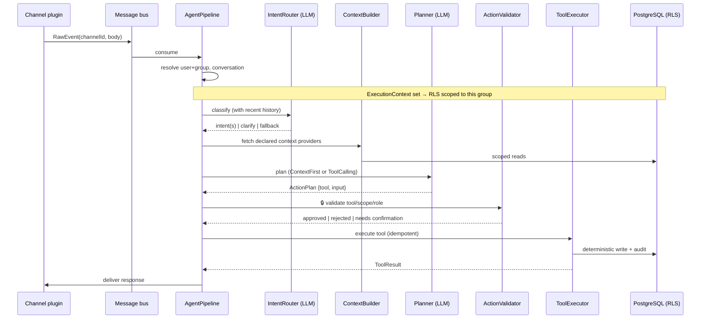
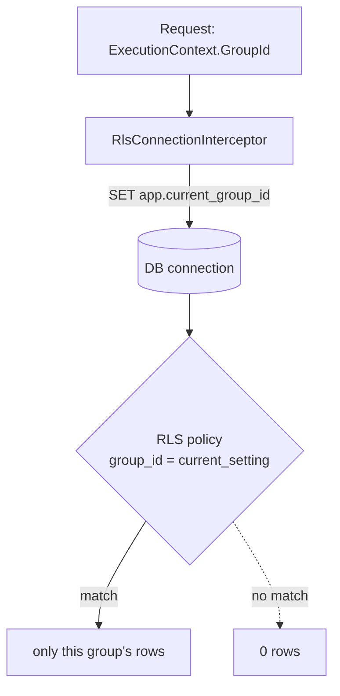
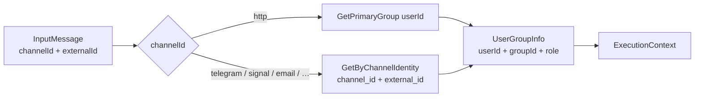

# Architecture

This document explains how AgentPlatform works under the hood: the request lifecycle, the trust
boundary, how tenants are isolated, and the supporting machinery (budget, scheduling, idempotency).

For *how to extend* the platform, see [`EXTENDING.md`](EXTENDING.md).

---

## Design principles

1. **The AI is never the source of truth.** The model plans and converses; **state lives in PostgreSQL**
   and changes only through deterministic tools. Factual answers ("what do I owe?") are read from the
   database, never invented by the model.
2. **Deterministic, idempotent tools.** A tool is plain C#. Running it twice has the same effect as once
   (first-wins, `INSERT … ON CONFLICT`, audited).
3. **Structural context isolation.** Tenants (households/workspaces) are isolated with PostgreSQL
   **Row-Level Security**, enforced at the connection level — not by trusting the prompt.
4. **Trust boundary.** Everything the LLM outputs is untrusted until the `ActionValidator` approves the
   tool, scope and role.
5. **Bounded spend.** A budget enforcer caps LLM cost per request and per group; a circuit breaker stops
   runaway diagnostic loops.
6. **Core closed for modification, open for extension.** Capabilities arrive as plugins through stable SDK
   contracts; the host never changes to add a feature.

---

## The request lifecycle

Every message — web, Telegram, Signal, email — becomes a `RawEvent` on an in-process **message bus**.
A single `AgentPipeline` processes one event per DI scope:



### Stages (in `src/AgentPlatform.Core/Pipeline`)

| Stage | File | Responsibility |
|---|---|---|
| **User/conversation resolution** | `ConversationResolver` | Map the channel identity → platform user + group; resolve/refresh the conversation (handles `/reset`, incognito). |
| **Intent routing** | `IntentRouter` | A small-tier LLM classifies the message into one or more registered intents. **Conversation-aware**: recent turns are included so elliptical follow-ups continue the topic instead of being mis-routed. Low confidence → `clarify`; nothing fits → `fallback`. |
| **Context building** | `ContextBuilder` | Gathers only the scoped slices an intent *declares* it needs (`today.payments`, `group.shopping`, `datetime.now`…). |
| **Planning** | `Planner` / `PlanningStrategy` | Runs the model in the handler's mode: **ContextFirst** (one call → one tool) or **ToolCalling** (a bounded loop with the circuit breaker on every iteration). |
| **Parsing** | `PlanParser` / `PlanResponseValidator` | Turn raw model output into a validated `ActionPlan` (salvages tool input, rejects malformed plans). |
| **Trust boundary** | `ActionValidator` | Reject tools not in the intent's allow-list; enforce role/scope; flag high-impact actions for confirmation. |
| **Execution** | `ToolExecutor` | Validate tool input against its JSON Schema, run it idempotently, write the audit log, route failures to a dead-letter queue. |
| **Response** | `ResponseBuilder` / `OutputRouter` | Build the reply and deliver it back to the originating channel. |
| **Fallback** | `SmalltalkResponder` | When no intent matches, answer conversationally from the model's own knowledge (greetings, general questions) — **without** inventing household data. |

---

## Planner modes

- **ContextFirst** — the handler pre-declares the context it needs; the model makes **one** call and
  returns a single tool selection. Used by most CRUD-style intents (add payment, mark task done).
- **ToolCalling** — the model runs a **bounded loop**, calling read-only tools to gather information
  before answering (e.g. incident triage). Every iteration is checked by the budget circuit breaker.

A handler is purely declarative — it never calls the LLM itself:

```csharp
public sealed class AddPaymentHandler : IIntentHandler
{
    public string IntentId => "family.add_payment";
    public PlannerMode Mode => PlannerMode.ContextFirst;
    public string[] RequiredContextProviders => [];
    public string[] AllowedTools => ["family.payments.create"];
    public string PromptTemplateId => "add_payment";
    public ModelTier PreferredTier => ModelTier.Small;
    public ConfirmationPolicy Confirmation => ConfirmationPolicy.NotRequired;
}
```

---

## The trust boundary

The model's output is **data, not instructions**. Before any side effect:

1. **Tool allow-list** — the chosen `ToolId` must be in the intent handler's `AllowedTools`.
2. **Scope & role** — the tool declares a `ScopeRequirement` (User/Group + minimum role); the
   authenticated caller must satisfy it. Checked **server-side**, never from a client claim.
3. **Input validation** — tool input is validated against the tool's JSON Schema.
4. **Confirmation** — high-impact actions return a confirmation prompt; the action only runs after an
   explicit "✅" (in chat, an inline button, or a `TAK` email reply).

The generic deterministic endpoint `POST /api/action {tool, input}` runs any tool through the same
executor **without the LLM** — this is what tap-to-confirm buttons call.

---

## Tenant isolation (Row-Level Security)

Each request runs inside an `ExecutionContext` carrying the `GroupId`. An EF Core connection interceptor
sets `app.current_group_id` on every connection, and RLS policies (`USING group_id = current_setting(...)`,
with `FORCE ROW LEVEL SECURITY`) constrain every read and write to that group.



> ⚠️ **Production caveat:** RLS only enforces under a **non-superuser** database role. The app must connect
> as a role with `NOSUPERUSER` and no `BYPASSRLS`. The integration tests prove isolation by setting
> `SET ROLE app_rls`. The repository methods are also explicitly group-scoped as defense-in-depth.

Plugins may own their own Postgres **schema** (e.g. `family.*`) via `IPluginRegistration.DbSchema`, with
their own migrations — still under the same RLS contract.

---

## Identity & the multi-user model

A group is not one person. The pipeline resolves **who** is talking and **which group** they belong to on
every message, and that drives both RLS (the group) and the trust boundary (the user + role).

### Resolving a message to a user

Each channel produces an `InputMessage` carrying a channel-level identifier (a Telegram chat id, a phone
number, an email, or — for web — the platform user id). `ResolveUserAsync` maps it to a platform user:



- **Channel identities are generic.** Messaging accounts — including **email** — live in a
  `channel_identities(channel_id, external_id, user_id, is_primary)` table; the core has **no per-channel
  columns** on `users`. A new channel plugin needs zero schema changes; `unique(channel_id, external_id)`
  enforces "one external id ↦ one user" at the DB level. Users link their own accounts (in-chat, or via
  the `link-telegram` / `link-email` CLI).
- **Email can be many per user.** A user may have several email addresses (all `channel_id="email"` rows);
  one is `is_primary` and used for agent-initiated outbound (notifications). Inbound from *any* of them
  resolves to the user, and replies go back to the exact address used. `http` (the platform user id) is
  the only non-identity case.
- **Primary group** = the user's oldest-joined group. The resulting `ExecutionContext` carries `UserId`,
  `GroupId`, `GroupType`, and `UserRole` for the rest of the pipeline.
- **Unknown senders** are rejected before any work happens.

### Groups, roles & scope

Users belong to groups (`household`, `workspace`, …) with roles mapped to core levels
`Admin` / `Member` / `Guest` (an `IGroupTypeProvider` maps plugin-specific role names like `owner` or
`child`). Every tool declares a `ScopeRequirement` (User/Group + minimum role); the trust boundary
enforces it **server-side**, never from a client-supplied claim.

### Talking about other members

The assistant understands references to people, not just ids. `IGroupDirectory.ResolveByNamesAsync` matches
free-text names against group members **tolerantly** — diacritics are folded and Polish declensions are
stemmed, so "jadę z Agatą i Olą" resolves *Agatą → Agata* and *Olą → Ola* to the right members. This powers
features like naming who to notify for a shopping trip.

### Shared state, personal delivery

State is shared within a group (one shopping list, the household's bills), but delivery is per-person:

- **Opt-in notifications.** A shared shopping list pings only standing watchers or the people named for a
  trip — not everyone by default.
- **Per-user `notify_mode`** (`auto` / `email` / `silent`) and per-user channel identities decide *how*
  each person is reached; `INotificationService` fans out accordingly (live SSE → messaging → email).
- **First-wins on shared records.** Concurrent "mark paid" / "check off" by different members resolve to a
  single deterministic write; the rest are safe no-ops.

## Supporting machinery

### Budget & circuit breaker
`BudgetEnforcer` records every LLM call's token cost (per request and per group) and trips a circuit
breaker when a request or a group exceeds its cap — preventing both runaway loops and surprise bills.

### Idempotency & audit
`ToolExecutor` writes an idempotency key (`INSERT … ON CONFLICT DO NOTHING`) so replays are safe, records
every action in an **audit log** (a secondary history source even after a conversation reset), and routes
terminal failures to a **dead-letter queue**.

### Scheduling
`ISchedulerService` (Hangfire-backed) handles one-off and recurring jobs; recurrence is **DST-safe** via
NodaTime (rules + zone stored, not a fixed UTC instant). Plugins declare recurring work with
`IScheduledJob` (e.g. `family.reminder-scan` hourly, `email.imap-poll`).

### Notifications
`INotificationService` delivers along a chain: **live SSE** (web chat) → **messaging channel**
(Telegram/Signal, resolved via generic `channel_identities`) → **email fallback**. A per-user
`notify_mode` (`auto` / `email` / `silent`) tunes it. Notifications can carry a **tap-to-confirm action**
(a tool id + input) so a reminder's "✅ Zapłacone" button runs a deterministic tool.

### Conversation & memory
Conversations are persisted with summaries; semantic memory (pgvector) and full-text history search let
the assistant recall facts and past actions across sessions.

---

## Composition root

`src/AgentPlatform.Api/Program.cs` wires built-in plugins and then discovers everything generically:

- Tools / handlers / context providers → resolved from DI by the registry.
- `IScheduledJob` → registered with Hangfire by a generic `ScheduledJobRunner` (dispatch by id).
- `IPluginUi` → embedded `wwwroot` served at `/plugins/{id}/…`.
- `IWebhookHandler` → each `Route` mapped as a POST endpoint.
- Plugin namespaces validated against tool/intent ids (contract enforcement).

The host references **no plugin type** for any of these mechanisms — adding a plugin requires zero changes
here. See [`EXTENDING.md`](EXTENDING.md).
